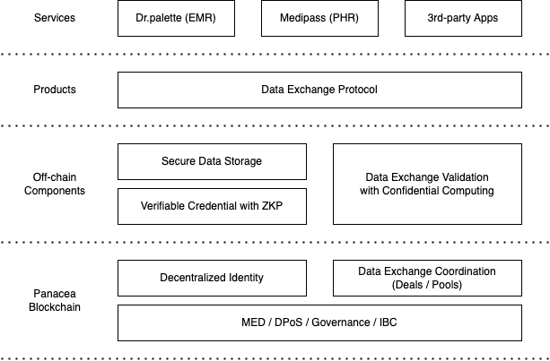

# Panacea Ecosystem

## Mission

Allow patients to own their data, provide the data to data consumers, and get incentivized.

## Goal

Build decentralized healthcare data sharing/exchange protocols

## Tech Stack

## Panacea blockchain

Panacea is a public blockchain based on the Cosmos SDK and the Tendermint.

As the Tendermint implements a partially synchronous BFT (Byzantine fault-tolerant) consensus protocol,
Panacea can provide a high-performance, consistent, and secure decentralized network
where strict fork-accountability guarantees hold over the behavior of malicious actors.

On top of that, the Cosmos SDK implements the DPoS (Delegated Proof of Stake) model
and provides various cryptographic operations such as tokens, governance, and IBC (Inter-Blockchain Communication).

Based on the model of the Cosmos SDK and the Tendermint,
new features have been added to Panacea for building the patient-centered health data ecosystem.
We will cover details of each feature in the next chapters.

### Decentralized Identity

Authentication and authorization are essential to building services on the web (not just web3, but web2).
In decentralized nature, authentication and authorization can be achieved by [DID](https://www.w3.org/TR/did-core/) (Decentralized Identifier).

Panacea provides DID management features that conform to the specification of W3C (World Wide Web Consortium),
so that users can verify their identity or the integrity of their data without relying on any third-party authorities.
Anyone can create, update, and deactivate DIDs on Panacea, which guarantees the integrity of
DID-related cryptographic data including DID public keys.

In the healthcare data ecosystem, DIDs are used to prove who issued the data, who owns it, and with whom the owner has agreed to share the data.
Data issuers and holders (owners) can sign on data using a private key that corresponds to their DIDs.
Then, data verifiers (receivers) can verify that the data has been not tampered with since the data was issued/shared.

### Data Exchange Coordination

Panacea provides a feature of coordinating data exchange deals.
Data consumers can publish deals publicly, specifying 1) which data they want to purchase and 2) how much budget they are willing to pay.
Data providers (holders) who agree to provide their data with the data consumers can provide their data securely and earn MED as rewards.

This on-chain data exchange coordination must work with some off-chain components to verify data validity/integrity and to deliver data securely.
For example, some malicious data providers could try to sell data that the data consumers don't want or that was forged by themselves (not by trusted issuers).
Therefore, data should be validated by off-chain data validators before being delivered to data consumers, as described in the [Data Exchange Validation](#data-exchange-validation-with-confidential-computing) section.

## Off-chain components

### Verifiable Credential with Zero-knowledge Proof

Using [Panacea Verifiable Credential SDK](https://github.com/medibloc/vc-sdk), data issuers can issue healthcare data as verifiable credentials that can be verified based on cryptographic keys and signatures.
Since [Verifiable Credential](https://www.w3.org/TR/vc-data-model/) is a standard format defined by W3C, any data receivers can verify credentials without any compatibility issues using the data issuer's (holder's) cryptographic public key that is corresponding with their DID.
In other words, the Verifiable Credential SDK works with DID management features of the Panacea blockchain.

In addition, data holders can present their data while masking privacy-sensitive fields.
This can be achieved by Zero-knowledge Proof using BBS+ signatures so that data receivers can verify data integrity even though some fields in the data are masked (technically, ' tampered').

### Data Exchange Validation with Confidential Computing

As described in the [Data Exchange Coordination](#data-exchange-coordination) section, Panacea blockchain provides data exchange coordination. However, data that is exchanged between providers and consumers cannot be validated/delivered through a public blockchain because all transaction data is exposed to everyone.
Even if transaction data is encrypted, validator nodes should be able to decrypt data to verify data validity/integrity.
That could be a huge vulnerability, allowing data to be leaked to anyone other than intended data consumers.
To avoid this vulnerability, we could have implemented this data exchange validation as smart contracts run on [Secret Network](https://scrt.network/), but still, we didn't want to expose private data on the public blockchain even if all data is encrypted.

Instead of solving this problem on chain, we have introduced an off-chain decentralized oracle powered by confidential computing ([Intel SGX](https://www.intel.com/content/www/us/en/developer/tools/software-guard-extensions/overview.html)).
Like Secret Network, all oracle nodes are run in the secure enclave. All data is encrypted so that only oracle nodes can decrypt it to verify data validity/integrity. If data is verified successfully, it is re-encrypted by oracle nodes for the data consumer.
Because this process is executed in the secure enclave, decrypted data cannot be stolen by anyone, even oracle node operators.

### Secure Data Storage

Based on DIDs, Verifiable Credentials, and Data Exchange Coordination/Validation, it seems that applications that handle privacy data can be implemented on top of Panacea.
However, to actually implement applications, the specific method on how data will be stored and how it will be transmitted in decentralized environments should be decided.

Thanks to [IPFS](https://ipfs.io/), data can be transmitted by [content addressing](https://docs.ipfs.tech/concepts/content-addressing/) in environments where ecosystem participants don't know each other's IP addresses and ports.
However, IPFS is also a public network, which is unsuitable for storing privacy data even if it is encrypted. IPFS also provides a way to set up private clusters, but it is not flexible enough to be used for based on public blockchains.

To solve this problem, MediBloc team is still researching many secure decentralized data storages including edge databases.
