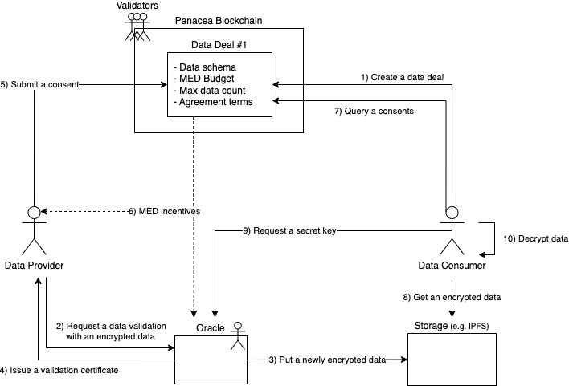

# How DEP Works

In this guide, you can learn about the DEP flow and how DEP works.

- [DEP flow](#dep-flow)

You can also see how we solved the problem described on [DEP and the problems it solves](./1-DEP-problems-it-solves.md);

- [For data privacy](#for-data-privacy)
- [For data validation](#for-data-validation)
- [Atomic incentive](#atomic-incentive-distribution)
- [Decentralization & Scalability](#decentralization--scalability)

## DEP flow

The diagram describes each key player interacts with each other to complete a cycle of data exchange. The whole process consists of several steps below.

### Data Deal Registration

A data consumer creates a data deal, specifying data schema, a budget in MED, the maximum number of data to consume, and agreement terms. The data consumer should publish the data deal to a public and secure environment, such as a public blockchain, to ensure that the data deal is not changed by anyone else after it is created. In this document, the Panacea blockchain is used for that public environment. For more details of the data deal, please see the [Data Deal](2-data-deal.md) specification.

### Data Validation

A data provider willing to provide data that meet the requirements desired by a data consumer should request a data validation to one of the verified oracles in the network.
The oracle validates the validity and integrity of data based on the requirements specified by the data consumer in the data deal. As a result of the data validation, the oracle issues a data validation certificate with a cryptographic signature. Also, the oracle uploads the data to the storage accessible by the data consumer.
The data is encrypted securely for each communication. For more details on the data validation and encryption, please see the [Data Validation](../../3-protocol-devs/1-dep-specs/4-data-validation.md) and the [Confidential Oracle](../../3-protocol-devs/1-dep-specs/5-confidential-oracle.md) specifications.

### Consent Submission

The data provider submits a consent of data provision, including the data validation certificate issued by the oracle.
The Panacea blockchain, operated by validators, validates the conformance and integrity of the consent and the data validation certificate.
For more details on the consent and the data validation, please see the [Data Provider Consent](../../3-protocol-devs/1-dep-specs/3-data-provider-consent.md) and [Data Validation](../../3-protocol-devs/1-dep-specs/4-data-validation.md) specifications.

### Incentive Distribution

As soon as the consent is accepted by the Panacea blockchain, the proper amount of MED coins are automatically distributed to the data provider and the oracle that issued the data validation certificate.
It is safe to distribute incentives right after the consent submission is accepted because the data consumer can immediately access the provided data.
The amount of incentives for each data provision is calculated by the total budget and the maximum number of data to consume specified by the data consumer in the data deal. The distribution ratio between the data provider and the oracle is determined by the commission rate promised by the oracle in the Panacea blockchain.
For more details, please see the [Incentives](../../3-protocol-devs/1-dep-specs/6-incentives.md) specification.

### Data Delivery

As a result of the [Data Validation](#data-validation) and [Consent Submission](#consent-submission), the encrypted data is uploaded to the storage, and the data consumer can obtain the unique identifier of the data stored in the storage from the Panacea blockchain. Using the unique identifier, the data consumer fetches the encrypted data from the storage.
To decrypt the data, the data consumer requests a secret key to the oracle that validated the data and issued the validation certificate contained in the submitted consent.

## For data privacy

### Data privacy between provider & oracle

In the process of [Data Validation](#data-validation), data provider first sends data to oracle for data verification and receives a certificate.
In this process, the provider encrypts the data with the public key of the oracle and its own private key.
The oracle private key is sealed in the enclave environment, so the data cannot be decrypted by anyone except the oracle.

### Data privacy in oracle

In the process of [Data Validation](#data-validation), the oracle decrypts the encrypted data with oracle private key and obtains the original data.
However, the oracle we defined must run in an enclave environment, and the enclave memory cannot be read or written outside the enclave.
Therefore, it is impossible to leak the original data and data privacy is continuously protected.

### Data privacy between provider & consumer

After completing the [Data Validation](#data-validation), oracle encrypts the data and provides this encrypted to the consumer.
t this time, a symmetric key based on the oracle private key is generated, so the data cannot be decrypted until the consumer also receives this symmetric key.
After the [Incentive Distribution](#incentive-distribution) process is completed, the consumer can request the symmetric key from the oracle.
The oracle checks whether the incentive distribution process is completed from the panacea blockchain, and provides the secret key encrypted based on the consumer's public key.
As a result, it is impossible for the provider to obtain the original data before the incentive is paid, and the secret key cannot be obtained except by the consumer.

## For data validation

Oracle validates the data after receiving encrypted data from the provider.
After the basic deal status, data hash validation, oracle checks whether the data satisfies the requirements specified in the deal.
here are two types of data requirements that can be specified in the deal (json schema validation, presentation definition validation).

[Json schema](https://json-schema.org) validation checks whether the data satisfies the conditions for the schema definition.
[Presentation definition](https://identity.foundation/presentation-exchange/#presentation-definition) validation checks that the data is in the form of a did-based verifiable presentation and satisfies the presentation definition.
This validation can additionally verify that the data was created from a verifiable credential issued by a Certificate Authority, and thus can verify that the data is authenticated by the Certificate Authority.

## Atomic incentive distribution

After receiving the certificate from oracle, the provider can get the incentive through [Incentive Distribution](#incentive-distribution) process.
In this process, panacea blockchain checks the certificate information and immediately completes the incentive payment to the provider, and at the same time enables the consumer to obtain the secret key to decrypt the provided data.
Thus, the provider is guaranteed to be rewarded for providing the data, and the consumer is guaranteed to access the data after completing the payment.

## Decentralization & Scalability

The DEP components, panacea blockchain and oracle, are open decentralized ecosystem where everyone can participate.
Panacea blockchain is a decentralized ecosystem where anyone can participate as a full node as a public blockchain, and tx is confirmed through the consensus of validators. 
In addition, oracle can also participate through the oracle registration process of the panacea blockchain.

Panacea blockchain validators can get block generation rewards by participating in the consensus, and oracle can get commissions as incentives are paid out.
This reward system can make a healthy decentralized ecosystem.

A provider or consumer can request to any registered oracle and receive the same result.
Therefore, consumers and providers can choose one of several registered oracles to perform [Data Validation](#data-validation) and [Data Delivery](#data-delivery).
This DEP structure that allows the validation process to be divided into the oracles.
As a result, data validation in oracle can be processed in parallel by multiple oracles and the overall performance of DEP improves as the number of oracles increases.

## Further Reading

- For more detailed specification of DEP, see [DEP specifications](../../3-protocol-devs/1-dep-specs/0-overview.md).
- For more information about Oracle, see the [Operate Oracle Nodes](../../5-oracles/1-operate-oracle-nodes/0-overview.md).
