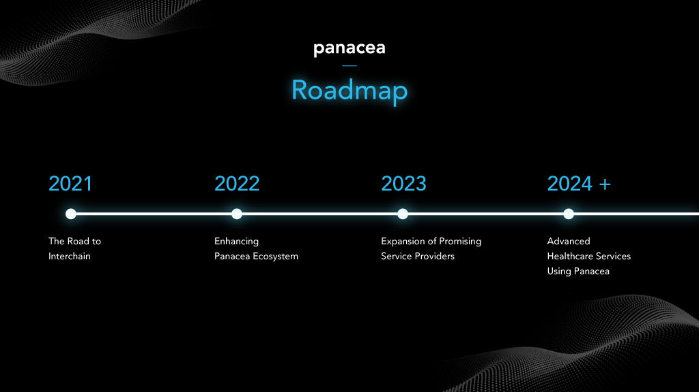

# Roadmap

Until 2021, MediBloc focused on upgrading Panacea to be more secure and interconnectable with other chains in Cosmos ecosystem. Inter Blockchain Communication (IBC) was enabled after the chain was upgraded with Cosmos SDK Stargate, and MED became tradable on one of the biggest decentralized exchange, Osmosis. On top of this, many professional validators and delegators have joined Panacea to enhance the security of the chain.

Now, MediBloc would like to shift its focus to boosting the potential of Panacea ecosystem and we believe that fruitful and meaningful data exchange will achieve that goal. Hence, MediBloc Panacea Team has been designing the Data Exchange Protocol based on Panacea. As you know, MediBloc believes that healthcare data should be owned by patients and those patients can take high-quality services by providing their healthcare data securely. Based on this philosophy, Data Exchange Protocol has been designed for anyone who holds data (even the sensitive data) to provide/sell their data to someone who is really willing to pay for it.

Nowadays, many businesses and technologies are data-driven. Many companies are already familiar with handling large dataset and deriving new values by analyzing sets of data. But, secure data exchange is still the one of the hardest area for data-driven industries. Data requesters want well-refined data or fine-grained raw data for successful data analysis. But, data owners (individuals) don’t want their privacy exposed and abused. Additionally, Web3 users are already aware that proper rewards should be guaranteed for their data and actions transparently on Web3. Traditional systems in Web2 have solved this issue in various ways, but MediBloc believes that we all can build more transparent and reliable systems for secure data exchange in Web3 ecosystem. 

Our data exchange protocol has the concept of data Pool, so that anyone can specify the type and the quantity of the data they want. Also, they can specify how much cryptocurrency they are willing to pay for the data. All of these data pools are recorded in Panacea and everyone who wants to sell their data can see all data pools. Data providers can choose data pools by checking how many parts of their data to be shared to data consumers. Then, they sign the consents for data exchange. Verified off-chain data validators validate whether data provided by data providers conforms to criteria that data pool creator has specified. If all the requirements are met, the data is provided to data consumers via secure connections and the promised amount of cryptocurrency is transferred to data providers. In this entire protocol, data is not recorded on any blockchain such as Panacea. All data transmissions are performed off-chain and Panacea guarantees all agreements for data exchanges and transparent payments.

This data exchange protocol is being developed to be as general as possible, so that not only the healthcare data but also all the other types of data can be handled by the protocol. Since Panacea and data exchange protocol is publicly opened, any service providers can build their own services on the top of the data exchange protocol, so that their users can exchange their data securely and get proper rewards. As the first use case, MediBloc is going to build a healthcare data marketplace service based on this protocol.
Well, it sounds like the protocol should work well, right? However, there are many issues that we have to resolve. For privacy and security, data providers should be able to expose only a small part of their data that is really desired by data consumers. Also, data transmission must be secure, so that no one can steal or intercept the data. In order to guarantee the right of data consumers, all criteria that data consumers specified has to be validated clearly before the payment is finalized. Last but not least, the ecosystem should be attractive enough for many data providers and consumers to join. 

In order to resolve these challenges, the team is developing this data exchange protocol with several latest technologies.
The detailed tech stack of the data exchange protocol is described in the [Panacea Ecosystem](./0-panacea-ecosystem.md) document.

There will be more detailed issues that we would have to solve, and we know that all of them cannot be solved in one step. Hence, we will complete this big task step by step. In 2022, MediBloc have released the v0 of data exchange protocol as a proof of concept that includes only essential features on testnet. Based on this proof of concepts, the data exchange protocol will be improved as v1 in 2023 with enhanced security and interoperability. Also, MediBloc will be introducing dApps for data providers using data exchange protocol and keep designing the services that go on top of data exchange protocol. MediBloc has already opened all source codes and progresses publicly on GitHub. We encourage anyone to join the project and share your insights. 
We are so excited and thrilled to share our vision to achieve our goal to become the world’s best patient centric health data platform. Thank you for your continued support! 

--
