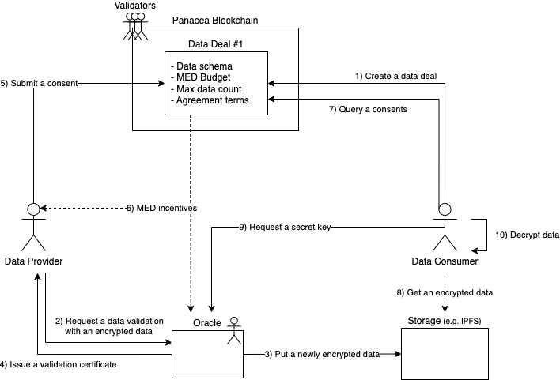

# User Flow

- Status: Draft
- Created: 2023-01-11
- Modified: 2023-01-11
- Authors
  - Youngjoon Lee <yjlee@medibloc.org>
  - Gyuguen Jang <gyuguen.jang@medibloc.org>
  - Hansol Lee <hansol@medibloc.org>
  - Myongsik Gong <myongsik_gong@medibloc.org>
  - Inchul Song <icsong@medibloc.org>
  - Tae Jin Yoon <tj@medibloc.org>

## Synopsis

This document specifies the entire user flow in the Data Exchange Protocol (hereafter 'DEP').
This document defines the key players essential to operate the DEP, and describes how the players interact to complete the whole data exchange process.

It is recommended to walk through this document first before diving deeply into detailed specifications.

### Motivation

DEP aims to establish a reliable communication layer between two parties who do not have strong trust in each other in decentralized environments.
To achieve this goal without centralized/authorized mediators, DEP introduces four key players: data consumer, provider, oracle, and chain validator. These key players collaborate to verify all aspects of the data exchange to minimize security/privacy vulnerabilities.

### Definitions

#### Key Players

##### Data Consumer
A data consumer is an individual or an organization who wants to consume certain kinds of data for specific purposes, with or without paying.

##### Data Provider
A data provider is an individual or an organization that holds data and a permission to provide data to data consumers to obtain benefits, such as incentives or services.

##### Oracle (Oracle operator)
An oracle is a data validator that guarantees validity and integrity of the data before data is delivered from data providers to data consumers.
Data verification is essential to ensure the atomicity of data delivery and incentive payments.

##### Panacea Blockchain Validator
A Panacea blockchain validator is a blockchain node operator that participates in the blockchain consensus process to guarantee the integrity of the whole process of DEP, which includes consuming data, providing data, validating data, and executing payments.

## Technical Specification

The diagram describes each key player interacts with each other to complete a cycle of data exchange. The whole process consists of several steps below.

### Data Deal Registration

A data consumer creates a data deal, specifying data schema, a budget in MED, the maximum number of data to consume, and agreement terms. The data consumer should publish the data deal to a public and secure environment, such as a public blockchain, to ensure that the data deal is not changed by anyone else after it is created. In this document, the Panacea blockchain is used for that public environment. For more details of the data deal, please see the [Data Deal](2-data-deal.md) specification.

### Data Validation

A data provider willing to provide data that meet the requirements desired by a data consumer should request a data validation to one of the verified oracles in the network.
The oracle validates the validity and integrity of data based on the requirements specified by the data consumer in the data deal. 
As a result of the data validation, the oracle issues a data validation certificate with a cryptographic signature. 
Also, the oracle uploads the data to the storage accessible by the data consumer. For more details of the data storage, please see the [Consumer Service](5-consumer-service.md).
The data is encrypted securely for each communication. For more details on the data validation and encryption, please see the [Data Validation](4-data-validation.md) and the [Confidential Oracle](6-confidential-oracle.md) specifications.

### Consent Submission

The data provider submits a consent of data provision, including the data validation certificate issued by the oracle.
The Panacea blockchain, operated by validators, validates the conformance and integrity of the consent and the data validation certificate.
For more details on the consent and the data validation, please see the [Data Provider Consent](3-data-provider-consent.md) and [Data Validation](4-data-validation.md) specifications.

### Incentive Distribution

As soon as the consent is accepted by the Panacea blockchain, the proper amount of MED coins are automatically distributed to the data provider and the oracle that issued the data validation certificate.
It is safe to distribute incentives right after the consent submission is accepted because the data consumer can immediately access the provided data.
The amount of incentives for each data provision is calculated by the total budget and the maximum number of data to consume specified by the data consumer in the data deal. The distribution ratio between the data provider and the oracle is determined by the commission rate promised by the oracle in the Panacea blockchain.
For more details, please see the [Incentives](7-incentives.md) specification.

### Data Delivery

As a result of the [Data Validation](#data-validation) and [Consent Submission](#consent-submission), the encrypted data is uploaded to the storage, and the data consumer can obtain the unique identifier of the data stored in the storage from the Panacea blockchain. Using the unique identifier, the data consumer fetches the encrypted data from the storage.
To decrypt the data, the data consumer requests a secret key to the oracle that validated the data and issued the validation certificate contained in the submitted consent.

## Backwards Compatibility

Not applicable.

## Forwards Compatibility

To be described.

## Example Implementations

TODO: Repo URLs of panacea-core and panacea-oracle with specific tags

## Other Implementations

None at present.

## History

- 2023-01-11: Initial draft finished

## Copyright

All content herein is licensed under [Apache 2.0](https://www.apache.org/licenses/LICENSE-2.0).
