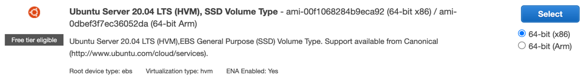
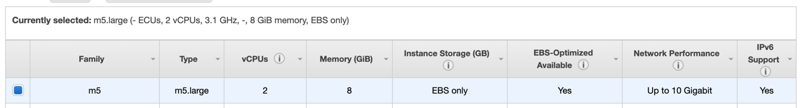

# Join the Network

This tutorial introduces deploying a new node on [AWS](https://aws.amazon.com/) and join the Panacea Mainnet.


## Launch an AWS EC2 Instance

### Choose an AMI

Choose Ubuntu Server 20.04 LTS 64-bit (x86) with SSD Volume Type.



### Choose the instance type

Choose the `m5.large` instance type (minimum spec).



### Configure instance details

Configuration | Value
--------------|-------
Network | Choose an existing VPC or default one if you don't have any
Subnet | Choose an existing subnet or default one if you don't have any
Auto-assign Public IP | Enable only if you access a full node from the outside of its VPC
Other fields | Follow default settings

### Add a storage

Configuration | Value
--------------|-------
Size | 500 GiB
Volume Type | `General Purpose SSD (gp3)`
IOPS | 3000
Throughput | 125 MB/s

### Configure a Security Group

Type | Protocol | Port range |  Description
-----|----------|------------|-------------
SSH | TCP | 22 |
Custom TCP | TCP | 26656 | P2P with other nodes
Custom TCP | TCP | 26657 | RPC
Custom TCP | TCP | 1317 | REST API

The P2P `26656` port must be exposed to other Panacea nodes.
If your node will be in the VPC guarded by Sentry nodes, expose `26656` to only Sentry nodes (recommended).
If not, expose it to anywhere.
For details about Sentry nodes, please see the [Tendermint guide](https://docs.tendermint.com/master/nodes/validators.html#local-configuration).

The RPC `26657` and REST API `1317` ports are for sending transactions/queries to your node.
So, expose them to the network where you perform operational actions.


### Connect to your EC2 instance and install prerequisites.

```bash
ssh ubuntu@<your-ec2-ip> -i <your-key>.pem
```

Install prerequisites by following the [Installation](installation.md) guide.


## Setup a New Node

These instructions are for setting up a brand new full node from scratch.

First, initialize the node and create the necessary config files:

```bash
panacead init <your_custom_moniker>
```


The `moniker` can contains only ASCII characters. Using Unicode characters will render your node unreachable.


Then, modify the `timeout_commit` in the `~/.panacea/config/config.toml` as below.
```toml
[consensus]

timeout_commit = "5s"
```

After that, edit the `~/.panacea/config/app.toml` file in order to enable the anti-spam mechanism and reject incoming transactions with less than the `minimum-gas-prices`:
```toml
# Validators reject any tx from the mempool with less than the minimum-gas-prices.
minimum-gas-prices = "5umed"

# NOTE: For the Testnet, please set minimum-gas-prices as "", so that no fee is required.
```

Now, your full node has been initialized!

### Copy the Genesis file

Fetch the `genesis.json` file of the latest chain from the following links, and place it to `~/.panacea/config/genesis.json`.
- Mainnet: https://github.com/medibloc/panacea-mainnet
- Testnet: https://github.com/medibloc/panacea-testnet

### Configure Persistent Peers

MediBloc is not operating seed nodes, but will provide them in near future.

Until then, please use public full nodes provided by MediBloc.
- Mainnet: https://github.com/medibloc/panacea-mainnet#persistent-peers
- Testnet: https://github.com/medibloc/panacea-testnet#persistent-peers

Insert those public nodes to the `persistent_peers` field in the `~/.panacea/config/config.toml`.

For more information on seeds and peers, see the [Using Tendermint: Peers](https://docs.tendermint.com/master/tendermint-core/using-tendermint.html#peers).

### State Sync

Your node can rapidly sync with the network using state sync without replaying historical blocks. For more details, please refer to [this](https://docs.tendermint.com/v0.34/tendermint-core/state-sync.html).

To set state sync enabled, RPC servers and trusted block info (height and hash) are required.

You can use the following public RPC endpoints provided by Medibloc team.
- 13.124.96.254:26657
- 52.79.108.35:26657

trusted block info can be obtained via RPC.

```shell
curl -s 13.124.96.254:26657 | jq -r '.result.block.header.height + "\n" + .result.block_id.hash'
# 7700000 (height)
# 0D3E53F02ABCDDA8AAC1520342D37A290DDABE4C28190EE6E2C6B0C819F74D4A (hash)
```

Then, you need to edit several things in `~/.panacea/config/config.toml` file.

```toml
[statesync]

enable = true

rpc_servers = "13.124.96.254:26657,52.79.108.35:26657" # rpc addresses
trust_height = <trusted-block-height>
trust_hash = "<trusted-block-hash>"
trust_period = "336h0m0s" # 2/3 of 21 days (unbonding period)

```

## Run a Full Node

Start the full node with this command:

```bash
panacead start
```

Check that everything is running smoothly:

```bash
panacead status
```

In production, it is recommended to run the process in background by following the guide below.

### Background Process

To run the node in a background process with automatic restarts, you can use a service manager like [systemd](https://wiki.archlinux.org/title/systemd).
This is more reliable way to run a background process in the long term.
To set this up, run the following:
```bash
sudo tee /etc/systemd/system/panacead.service > /dev/null <<EOF  
[Unit]
Description=Panacea Daemon
After=network-online.target

[Service]
User=$USER
ExecStart=$(which panacead) start
Restart=always
RestartSec=3
LimitNOFILE=4096

[Install]
WantedBy=multi-user.target
EOF
```

It is very important to set the `LimitNOFILE=4096` since Panacea opens many DB files.

If you're using Cosmovisor, add the following environment variables after the `LimitNOFILE` line and replace `$(which panacead)` with `$(which cosmovisor)`.
```
Environment="DAEMON_HOME=$HOME/.panacea"
Environment="DAEMON_NAME=panacead"
Environment="DAEMON_ALLOW_DOWNLOAD_BINARIES=false"
Environment="DAEMON_RESTART_AFTER_UPGRADE=true"
```
For more details about those environment variables, please see the [Cosmovisor guide](cosmovisor.md).

Then, setup the daemon.
```bash
sudo -S systemctl daemon-reload
sudo -S systemctl enable panacead  # the process will be started automatically whenever your system is booted.
```

You can then start the process and confirm that it is running.
```bash
sudo -S systemctl start panacead
sudo service panacead status

sudo journalctl -u panacead -f --output cat   # See logs from panacead
```

## Monitor the chain using block explorers

View the status of the network with block explorers.
- Mainnet: https://www.mintscan.io/medibloc or https://explorer.gopanacea.org/
- Testnet: https://testnet-explorer.gopanacea.org/

## Join as a validator

If you want to participate in validating blocks as a validator,
you can register yourself into the validator set by submitting a transaction.

For more details, see the [CLI guide: Create your validator](interaction-with-the-network-cli.md#create-your-validator).

If you already joined as a validator and if you want to modify your validator details, please see the [CLI guide: Edit validator description](interaction-with-the-network-cli.md#edit-validator-description).
