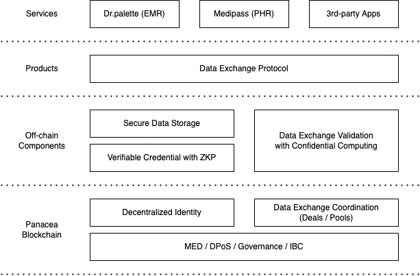

# Panacea Ecosystem

## Panacea blockchain

The Panacea is a public blockchain based on the Cosmos SDK and the Tendermint.

As the Tendermint implements a partially synchronous BFT (Byzantine fault-tolerant) consensus protocol,
Panacea can provide a high-performance, consistent and secure decentralized network
where strict fork-accountability guarantees hold over the behavior of malicious actors.

On the top of that, the Cosmos SDK implements DPoS (Delegated Proof of Stake) model
and provides various cryptographic operations such as tokens, governance and IBC (Inter-Blockchain Communication).

Panacea inherits all of their strengths without reinventing the wheel.
It means that Panacea can guarantee the fast finality and the solid network security
and can be connected with them without any compatibility/safety issues.

Based on the model of the Cosmos SDK and the Tendermint,
new features have been added to Panacea for building the patient-centered health data ecosystem.
We will cover details of each feature in next chapters.

### Decentralized Identity

Authentication and authorization are essential to building services on the web (not just web3, but web2).
In decentralized nature, authentication and authorization can be achieved by [DID](https://www.w3.org/TR/did-core/) (Decentralized Identifier).

Panacea provides DID management features which conforms to the specification of W3C (World Wide Web Consortium),
so that users can verify their identity or the integrity of their data without relying on any third-party authorities.
Anyone can create, update and deactivate DIDs on Panacea that guarantees the integrity of
DID-related cryptographic data including DID public keys.

In healthcare data ecosystem, DIDs are used to prove who issued the data, who owns it, and with whom the owner has agreed to share the data.
Data issuers and holders (owners) can sign on data using a private key that is corresponding to their DIDs.
Then, data verifiers (receivers) can verify that the data has been not tampered with since the data was issued/shared.

### Data Exchange Coordination

Panacea provides a feature of coordinating data exchange deals.
Data consumers can publish deals publicly with specifying details of which data they want to purchase.
And, data providers (holders) who agree to provide their data with consumers can provide their data securely and earn rewards in MED.

This on-chain data exchange coordination must work with some off-chain components that verify data validity/integrity with preserving privacy and deliver data securely.

## Off-chain components

### Verifiable Credential with Zero-knowledge Proof

Using [Panacea Verifiable Credential SDK](https://github.com/medibloc/vc-sdk), data issuers can issue healthcare data as verifiable credentials that can be verified based on cryptographic keys and signatures.
Since [Verifiable Credential](https://www.w3.org/TR/vc-data-model/) is a standard format defined by W3C, any data receivers can verify credentials without any compatibility issues using data issuer's (holder's) cryptographic public key that is corresponding with their DID.
In other words, the Verifiable Credential SDK works with DID management features of Panacea blockchain.

In addition, data holders can present their data with masking privacy-sensitive fields that aren't need to be revealed.
This can be achieved by Zero-knowledge Proof using BBS+ signatures so that data receivers can verify data integrity even though some fields in the data are masked (which means 'tampered' technically).

### Data Exchange Validation with Confidential Computing

As described above, Panacea blockchain provides the data exchange coordination. However, data that is exchanged between providers and consumers cannot be validated/delivered through a public blockchain because all data in transactions is exposed to everyone.
Even if data in transactions is encrypted, validator nodes should be able to decrypt data in order to verify data validity/integrity.
This could be a huge vulnerability that could allow data to be leaked to anyone other than intended data consumers.
To avoid this vulnerability, we could implement this data exchange validation as a smart contract that can be run on [Secret Network](https://scrt.network/), but still, we didn't want to expose privacy data on the public blockchain even if all data is encrypted.

Instead of solving this problem on chain, we have introduced an off-chain decentralized oracle powered by confidential computing ([Intel SGX](https://www.intel.com/content/www/us/en/developer/tools/software-guard-extensions/overview.html)).
Similar as Secret Network, all oracle nodes are run in the secure enclave. All data is encrypted so that only oracle nodes can decrypt it to verify data validity/integrity. If data is verified successfully, it is re-encrypted by oracle nodes for the data consumer.
Because this process is executed in the secure enclave, decrypted data cannot be stolen by anyone, even oracle node operators.

To avoid the Byzantine problem between decentralized oracle nodes, oracle nodes borrow the voting power from the Panacea blockchain.
Only operators who are running validators on Panacea can run oracle nodes. Then, an oracle node has the same voting power as a corresponding validator.
If an oracle node acts malicious behaviors, its validator's stake is slashed.