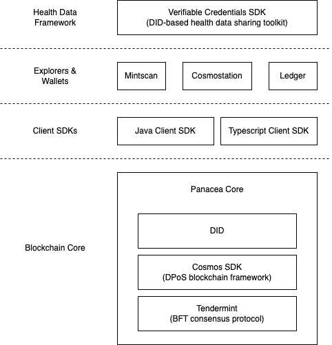
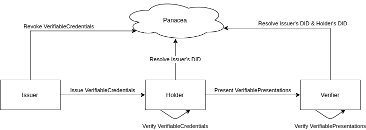

# Tech Stack

## The benefit from Cosmos SDK and Tendermint

The Panacea is a public blockchain based on the Cosmos SDK and the Tendermint.

As the Tendermint implements a partially synchronous BFT (Byzantine fault-tolerant) consensus protocol,
Panacea can provide a high-performance, consistent and secure decentralized network
where strict fork-accountability guarantees hold over the behavior of malicious actors.

On the top of that, the Cosmos SDK implements DPoS (Delegated Proof of Stake) model
and provides various cryptographic operations such as tokens, governance and IBC (Inter-Blockchain Communication).

Panacea inherits all of their strengths without reinventing the wheel.
It means that Panacea can guarantee the fast finality and the solid network security
and can be connected with them without any compatibility/safety issues.

Based on the model of the Cosmos SDK and the Tendermint,
new features have been added to Panacea for building the patient-centered health data ecosystem.
We will cover details of each feature in next chapters.

## DID (Decentralized Identifier)

Panacea provides a DID method which conforms to the specification of W3C (World Wide Web Consortium),
so that users can verify their identity or the integrity of their data without relying on any third-party authorities.
Anyone can create, update and deactivate DIDs on Panacea that guarantees the integrity of
DID-related cryptographic data including DID public keys.

The core usage of DID in the health data ecosystem is signing on the health data that needs to be shared to any
parties that want to verify whether the data is forgery or not.
As the mechanism of signing on data using DID and verifying signatures has been standardized by W3C,
anyone can easily use the Panacea DID without any compatibility issue.
Also, data holders can reveal only data that they really want to share using the DID-based ZKP(Zero-knowledge Proof).

This mechanism is so essential for the health data ecosystem because patients can keep the ownership of their health data
and choose the level of privacy by themselves.

## Smart Contract

Panacea provides the Smart Contract framework powered by CosmWasm.
Any developers can implement their own smart contracts using the Rust programming language and deploy them on Panacea.
It means that any fancy ideas such as DeFi and NFT can be implemented on Panacea,
and they can be used for boosting the liquidity of health data flow of medical systems built on Panacea.

## IBC (Inter-Blockchain Communication)

Since Panacea is a Cosmos-based blockchain, it can be connected with other Cosmos-based blockchains through the IBC protocol.
Also, bridges for non-Cosmos-based chains such as Bitcoin and Ethereum have being actively implemented
by various participants in the Cosmos ecosystem.

Of course, Panacea is going to be integrated with those inter-chain protocols for enabling more people to benefit from
the Panacea-based health data ecosystem.

