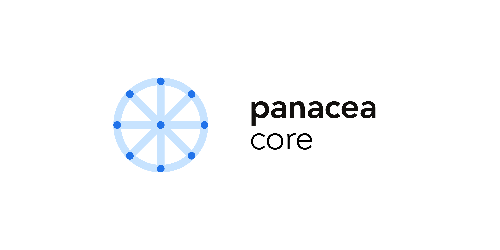

# Panacea-Core

**[MediBloc](https://medibloc.org)**, We introduce blockchain which is the key infrastrucuture for our services to reinvent the healthcare experience.

**Key Features:**

- In addition to medical data, AOL (Append Only Log), which can store various useful data, is implemented in a block chain.
- We used Tendermint consensus based on DPoS and PBFT.

**Panacea Core** is a golang implementation of the MediBloc protocol

 Core builds on [Tendermint](https://github.com/tendermint/tendermint) consensus and the [Cosmos SDK](https://github.com/cosmos/cosmos-sdk) toolkits. Please make sure to study these projects as well if you are not already familiar.

**Note**: Requires [Go 1.13+](https://golang.org/dl/)

## Status

### Network

- Mainnet Panacea is online. [The launch repo](https://github.com/medibloc/panacea-launch) contains snapshot of the launch as well as network updates. 

### Ecosystem

- [Block Explorers](https://explorer.medibloc.org)

- Wallet (To Be Released)

## Documentation

See the [docs](https://medibloc.gitbook.io/panacea-core/) here
